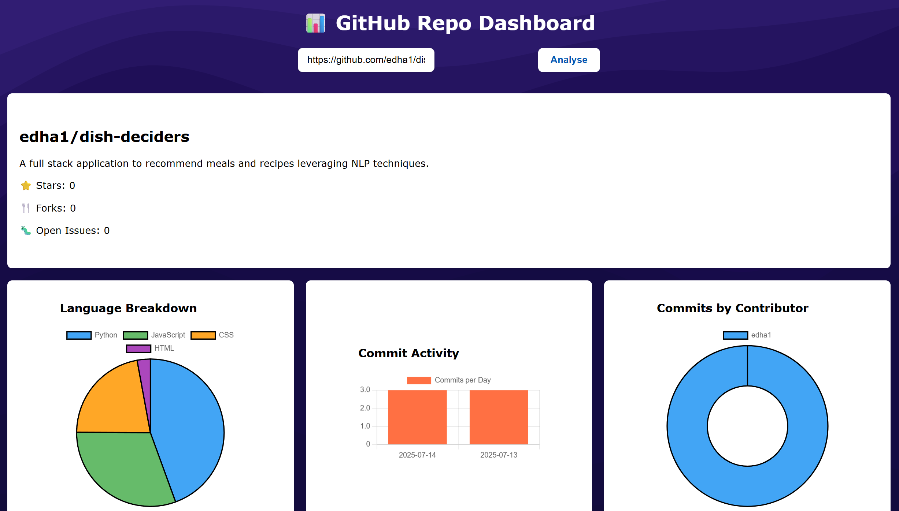

# 📈 GitHub Repo Dashboard

A React-based dashboard that visualises **public** GitHub repository data such as languages used and commits made using Chart.js and the GitHub API.

---

## ✨ How it works 

- User inputs a public repo's URL into the input bar
- Real-time repository data fetched from the GitHub API
- Displays repository stats like stars, forks, and contributors
- Visualises commits and programming languages with interactive charts
- Uses Chart.js for clean charts

---

## 🛠️  Technologies Used 

- React UI 
- Chart.js to display charts 
- GitHub API to retrieve information 
- Vite (fast build tool and dev server)
- Axios

---

## ⚙️ Demo



---

## 💡 How to use 

1. **Clone the repository:**
   ```bash
   git clone https://github.com/edha1/github-repo-dashboard.git
   cd github-repo-dashboard

2. **Install dependencies** 
    ```bash
    npm install chart.js react-chartjs-2 axios

3. **Create .env file and add API key** 
    VITE_GITHUB_TOKEN=your_github_token_here

4. **Run the app**
    ```bash
    npm run dev 

